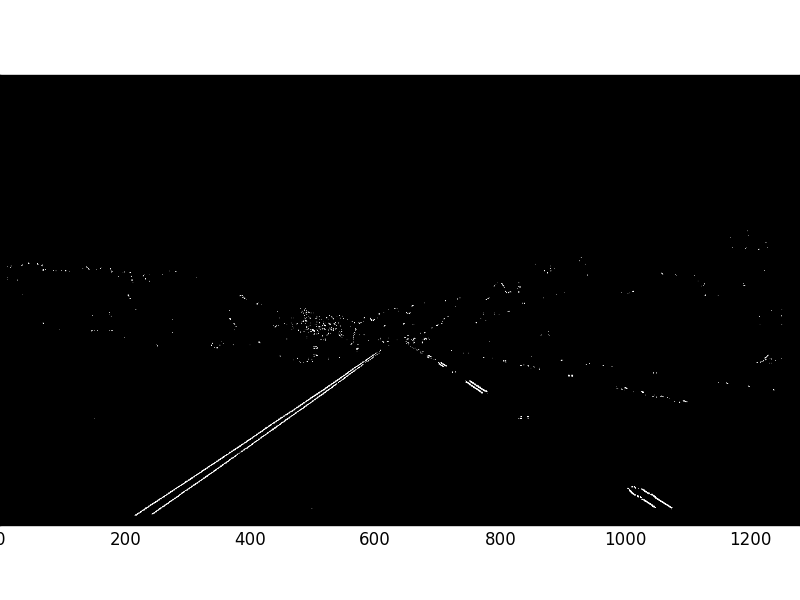
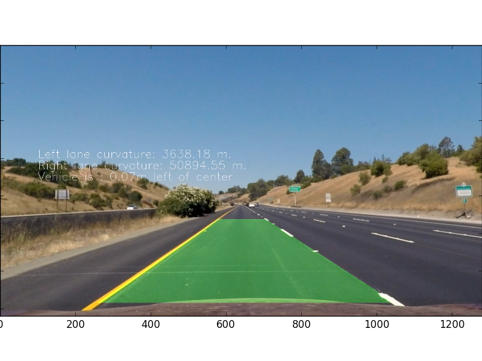
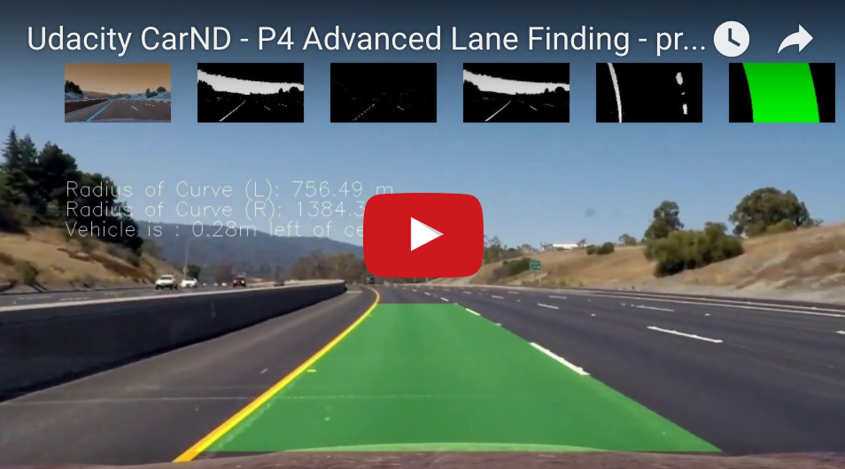

#Advanced Lane Finding

Here is the outline of methods used in this project to detect lane in a US highway. 

* Compute the camera calibration matrix and distortion coefficients given a set of chessboard images.
* Apply a distortion correction to raw images.
* Use color transforms, gradients, etc., to create a thresholded binary image.
* Apply a perspective transform to rectify binary image ("birds-eye view").
* Detect lane pixels and fit to find the lane boundary.
* Determine the curvature of the lane and vehicle position with respect to center.
* Warp the detected lane boundaries back onto the original image.
* Output visual display of the lane boundaries and numerical estimation of lane curvature and vehicle position.

Here is more detail description on each step:

## Camera Calibration
When a camera is used to take a photo of the 3D world, the resulting 2D image could be distorted due to radial or tangential distortion of the camera lens. For example, extra curvature might occur for objects appears near the edges of the image.  This could cause problem for self-driving car when the car uses the images taken by the on-board cameras to identify and analyze the world around it.  Specifically, a straight lane in the real world could be seen as a curved lane.  Therefore, the first step we take is to calibrate the camera.

To calibrate the camera, we are looking for two parameters that can describe the distortion and they are the camera matrix and distortion coefficients.  To get these values, we study the chessboard corners in the photo and comparing the location of these corners with what they should be if they were undistorted.  We then use these parameters to un-distort the images taken by the same camera.

---
Rubric 1. Briefly state how you computed the camera matrix and distortion coefficients. Provide an example of a distortion corrected calibration image.

---
The code for this section is in lines #6 through #8 of the file /source/video.py, which calls the Camera class defined in /source/camera.py.

There are two steps in this section:

1. Step #1: Camera Calibration
2. Step #2: Image Un-distortion

In step #1, camera calibration employes three OpenCV functions:

* **cv2.findChessboardCorners**: Finds the positions of internal corners of the chessboard.
* **cv2.drawChessboardCorners**: Renders the detected chessboard corners.
* **cv2.calibrateCamera**: Finds the camera intrinsic and extrinsic parameters from several views of a calibration pattern.

A set of images with chessboard pattern were first taken by the same camera from a variety of different angles.  These images can be found under /camera\_cal directiory.  Internal chessboard corners of each image are determined by the cv2.findChessboardCorners function.  We specify to the function to look for 9x7 corners and the function returns a non-zero value if all of the 9x7 corners are found and the location of these corners are placed in the img_points array in the order of row by row and left to right in every row.  If the function fails to find all of the corners, the function returns 0.  

We then use the drawChessboardCorners function to draw out the coners on the image to verify that the corners were determined correctly.

Here is an example of original image:

Here is the same image with 9x7 internal corners determined and drawn out explicitly:

Among the 20 images in the /camera\_cal set, 9x7 internal corners were found in 17 images. These 17 images with corners drawn on can be found in /output\_images/camera\_cal/draw\_corners directory. 

At this point, cv2.calibrateCamera can be used to figure out the camera matrix and distortion coefficients.  The first input to this function is the objectPoints, which is a 17-element array of the 3D representation of the undistorted rigs with all of the z-coordinates being 0.  The second input is the 17-element array of previously discussed img_points arrays.  The sizes of these two input arrays as well as the sizes of each array element should be exactly the same.  The output cameraMatrix(mtx) and distCoeffs(dist) are then used in the next step to un-distort images. 

In step #2, un-distort images employs the following OpenCV function:

* **cv2.undistort**: Transforms an image to compensate for lens distortion.

Once the camera matrix and distortion are found in the previous step, we can then use the cv2.undistort function to transform the image into the undistorted form.  

Here is the un-distorted image of previously shown image:

The un-distorted version of all 20 images can be found in /output\_images/camera\_cal/undistorted/ directory.

## Pipeline
Here is an overall diagram that depicts the pipeline of the steps we took to achieve the lane finding result from a single image taken from the camera onboard.

###Un-distort camera image 

After we figure out how to un-distort camera images, we can begin to un-distort the image of the road taken by the on-board camera.  The code for this section can be found in the file 
/source/land\_finding.py where it loops through all of the test images in the /test\_images directory.  

Here is an example of original/distorted image taken by the camera:

---
Rubric 2. Provide an example of a distortion-corrected image.

---
Here is the un-distorted version of the previous image:

The undistorted version for all of the test images can be found under /output\_images/test\_images/[name of the test image]/01-undistorted.jpg

### Pre-processing Image

---
Rubric 3. Describe how (and identify where in your code) you used color transforms, gradients or other methods to create a thresholded binary image. Provide an example of a binary image result.

---

With the undistorted image at hand, we pass it into the following steps to achieve a bird's-eye view of the lane in front of the car:

**1. White Color Filtering**: Transform the image into RGB channel and filter out anything is that not white. The code for this section can be found in the get\_white\_region\_binary\_rgb method of FSImage class defined in the /source/image.py file. Below is a grayscale image rendering the result from white color filtering:

**2. Yellow Color Filtering**: Transform the image into HSV channel and filter out anything that is not yellow.  The code for this section can be found in the get\_yellow\_region\_binary method of FSImage class defined in the /source/image.py file.  Below is a grayscale image rending the result of yellow color filtering:

**3. Yellow and White Color Filtering**: Combine the result from #1 and #2 with an OR operation on the previous filters. The code for this section can be found in the get\_white\_and\_yellow\_region method of FSImage class defined in the /source/image.py file.  Below is a grayscale image rending of the result:

**4. Sobel Filter-X**: Apply Sobel Filter on the X-direction onto the undistorted image from step #3.  The code for this section can be found in apply\_absolute\_sobel method of FSImage class defined in the /source/image.py file.  Below is a grayscale image rending of the result from Sobel Filter with orient set to x:

**5. Sobel Filter-Y**: Apply Sobel Filter on the Y-direction onto the resulting image from step #3. The code for this section can also be found in apply\_absolute\_sobel method of FSImage class defined in the /source/image.py file.  Below is a grayscale image rending of the result from Sobel Filter with orient set to y:

**6. Sobel Filter-X AND -Y**: Sobel filtering of X- and Y-directions: Combine the result of #4 and #5 with an AND operation on the previous two filters as the lanes ahead are generally appear diagonally in our images.  The code for this section can be found in apply\_sobel\_x\_and\_y method of FSImage class defined in the /source/image.py file.  Below is a grayscale image rending of the result:

**7. Combine Color Filters And Sobel Filters**: The results of the color filters from #3 and the results of the sobel filters from #6 are combined here via an OR operation as we hope to capture results from both filters.  The code for this section can be found in process\_image method of FSImage class defined in the /source/image.py file.  Below is a grayscale image rending:

**8. Region of Interest**: We will now filter out anything other than the central trapezoid region that contains the road lane.  The code for this section can be found in region\_of\_interest method of Lane class defined in the /source/lane.py file.  Below is a grayscale image rending of the interested region:

**9. Marking of Perspective Transform Source Points**: The code for this section can be found in draw\_perspective\_source\_on\_image method of Lane class defined in the /source/lane.py file.  Below you can see the four source points chosen:

---
Rubric 4. Describe how (and identify where in your code) you performed a perspective transform and provide an example of a transformed image.

---

**10. Bird's-eye view**: To create the bird's-eye view, we first use the OpenCV function cv2.getPerspectiveTransform to calculate a 3x3 matrix that transforms from four pairs of poitnts (src) to another four corresponding pairs of points (des).  Then we use the cv2.warpPerspective with the image from #9.  The code for this section can be found in perspective\_transform method in Lane class defined in /source/lane.py file.  Here is the rending of the bird's-eye view by perspective transform:

###Identifying the lane location

---
Rubric 5. Describe how (and identify where in your code) you identified lane-line pixels and fit their positions with a polynomial?

---
Now that we have two lanes displayed on the image, it is time to find out the locations they are in.  We first by finding out the center of each line by figure out which y-value is most frequently appeared in our binary image.  We can do this by finding the max value of the historgram.  We are only interested in the bottom half of the image as they are closer to the car.  Here is the historgram of the bird's-eye view: 

Next, we place sliding windows around the line centers in each window to collect all pixels that are potential lane pixels.  We then use NumPy's polyfit to find the least squares polynomial fit. Here is an image depicting the sliding windows (in green) method and the two polynomials that fit each lane (in yellow.)  

The code for this section can be found in the predict\_lanes method in Lane class defined in /source/lane.py.

### Validation via Curve Radius and Center Deviation

---
Rubric 6. Describe how (and identify where in your code) you calculated the radius of curvature of the lane and the position of the vehicle with respect to center.

---
We can validate our lane finding results by comparing the radii of curvature for the two polynomials we determined in the previous steps with the minimal requriement by the US government.  To calculate the curve radius, we first convert our fit polynomial from the pixel dimension to real world dimension.  Then we follow the forumla in this [tutorial](http://www.intmath.com/applications-differentiation/8-radius-curvature.php).  The code for this section can be found in get_curvatures method of Lane class definied in /source/lane.py file.  

The position of the vehicle with respect to center is calculated by finding the difference between the center of the left and right line and the center of the image (where the camera is mounted) at the bottom of the image.  The code for this section can be found in get\_deviation\_from\_center method of LaneFinder class definied in /source/lane.py file. 

### Lane Finding... Found!

---
Rubric 7. Provide an example image of your result plotted back down onto the road such that the lane area is identified clearly.

---
We now make an inverse transform to draw the lane found from the bird's-eye view back to the original image.  Here is an image that show the result:

---
Rubric 8. Provide a link to your final video output. Your pipeline should perform reasonably well on the entire project video (wobbly lines are ok but no catastrophic failures that would cause the car to drive off the road!)

---

If the above image doesn't work, the video can be accessed via this [link](https://youtu.be/xG9KsH1phAk).

---
Rubric 9. Briefly discuss any problems / issues you faced in your implementation of this project. Where will your pipeline likely fail? What could you do to make it more robust?

---
While the pipeline seems to work well with the project video, it depends on clear visibility of yellow as well as white lane and strong contrast of the lane marking.  Without either of these two things, for example, in cases such as bad weather condition or older roads, the pipeline could easily fail.  

Here are somethings that I would try to make improvement to the current algorithm:

- Figure out a way to increase the contrast of the image prior to processing it. 

- Identify non-lane objects in the proximity of the lanes.  

- Be more intelligent in leveraging the history of the previous lines.  Currently, when something goes wrong with the present lane, the algorithm will use the previous lane prediction. However, this could be dangerous when this happens repeatedly and at the same time as the lane makes a sharp turn.  

This project makes me aware how important, that in a situation where we need to replace the lens of the on-board camera, it is to use the exact model (or at lease one with the same distortion factor) as the replacement.  In situation where this is not possible, i wonder how does the car or the car owner callibrate the new onboard camera!?